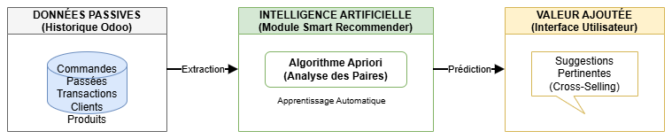
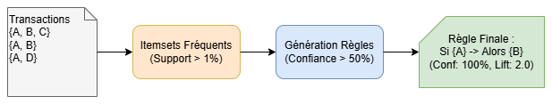
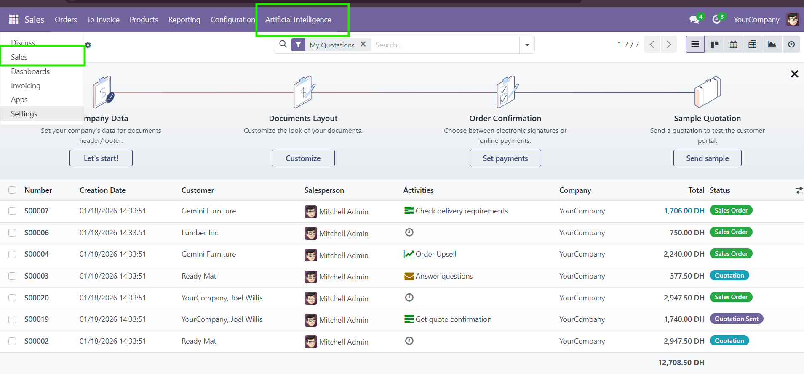
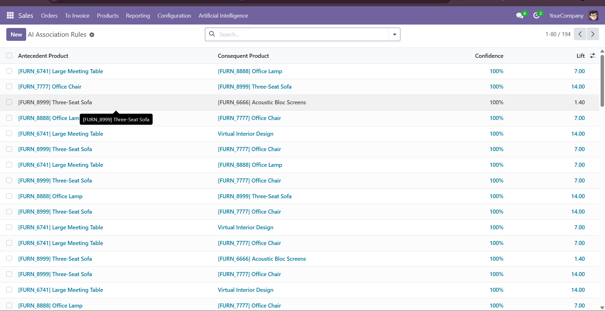
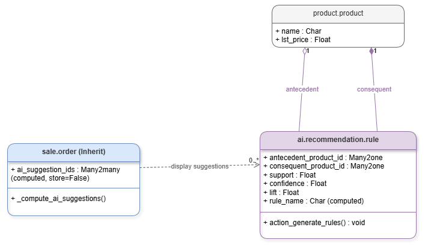

# 🧠 Smart Recommender AI for Odoo 17


> **Transform Odoo from a passive "System of Record" into a proactive "System of Intelligence".**

This module integrates a **Machine Learning Engine** (Association Rules Learning) directly into the Odoo Sales workflow. It analyzes historical sales data to suggest relevant **Cross-selling opportunities** to salespersons in real-time.

---

## 📸 The Result (Teaser)
*The AI suggests an "Office Chair" because the customer bought a "Meeting Table" (100% Confidence).*


---

## Project Overview

### The Problem
In standard ERPs, sales representatives often miss cross-selling opportunities because they rely on intuition rather than data. Manual analysis of sales patterns is time-consuming and outdated.

### The Solution
**Smart Recommender AI** automates this process using the **Apriori Algorithm**.
1.  **Extracts** confirmed sales orders from Odoo.
2.  **Mines** patterns using `pandas` and `mlxtend` (e.g., *Who buys A also buys B*).
3.  **Injects** suggestions into the Quotation view (`sale.order`) instantly.

---

## Architecture & Logic

### 1. Global Workflow
Data flows from the Odoo Database to the AI Engine, which generates Rules stored back in Odoo for real-time querying.



### 2. The AI Algorithm (Apriori)
We use the **Market Basket Analysis** method.
*   **Support:** How popular is an item?
*   **Confidence:** How likely is B purchased when A is purchased?
*   **Lift:** The strength of the correlation (>1 means strong link).



---

## 🚀 Key Features

*   **🤖 Automated AI Training:** One-click Server Action to retrain the model on new data.
*   **⚡ High Performance:** Suggestions are pre-calculated. The impact on the Quotation loading time is **< 50ms**.
*   **📊 Transparency:** Displays "Match Chance" (Confidence) and "Lift" so the salesperson understands *why* a product is suggested.
*   **🔌 Non-Intrusive:** Integrated via a custom Tab in the Sales view, leaving the standard workflow intact.

---

## 🛠 Tech Stack

| Component | Technology | Role |
| :--- | :--- | :--- |
| **ERP Core** | **Odoo 17 (Community)** | Backend framework & ORM. |
| **Language** | **Python 3.11** | Logic & Data processing. |
| **Data Manipulation** | **Pandas** | Transforming `sale.order.line` into Transaction Matrices. |
| **Machine Learning** | **Mlxtend** | Efficient implementation of the Apriori algorithm. |
| **Database** | **PostgreSQL 15** | Relational storage (isolated via Docker). |
| **Frontend** | **XML / OWL** | User Interface modifications. |

---

## 📥 Installation Guide

### Prerequisites
*   Docker & Docker Compose (Recommended)
*   Python 3.10+
*   Git

### Step 1: Clone the Repository
```bash
git clone https://github.com/8sylla/odoo-ai-recommender.git
cd odoo-ai-recommender
```

### Step 2: Install Python Dependencies
The module requires specific Data Science libraries.
```bash
pip install pandas mlxtend
```

### Step 3: Launch Odoo (Docker)
Use the provided docker-compose or run Odoo locally.
```bash
# Example running Odoo locally
python odoo-bin -c odoo.conf
```

### Step 4: Install the Module
1.  Go to **Apps**.
2.  Click **Update App Lists**.
3.  Search for `Smart Recommender AI`.
4.  Click **Activate**.

---

## 🕹 Usage Workflow

### 1. Generate Data (Cold Start)
*The AI needs data to learn.*
*   Create 3-5 Sales Orders with correlating items (e.g., *Table + Chair*).
*   **Confirm** these orders.

### 2. Train the Brain 🧠
*   Go to **Sales > Artificial Intelligence > Run AI Training**.
*   Wait for the success notification.



### 3. Get Suggestions 💡
*   Create a new Quotation.
*   Add a "Table".
*   Open the **"🤖 AI Suggestions"** tab.
*   **Result:** The "Chair" is suggested!

---

## 🖼 Screenshots Gallery

### The Knowledge Base (Generated Rules)
*A list of all correlations found by the system (e.g., Confidence 100%).*


### Data Model (UML Class Diagram)
*How the custom `ai.recommendation.rule` interacts with standard Odoo models.*


